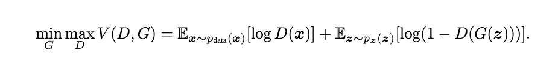
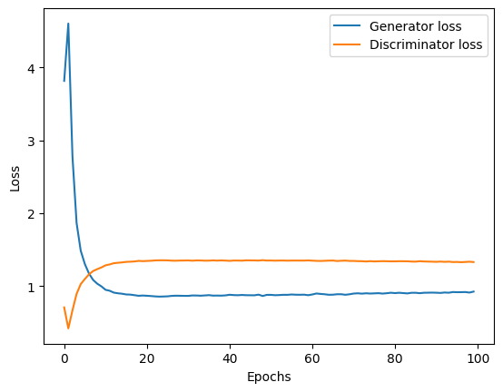
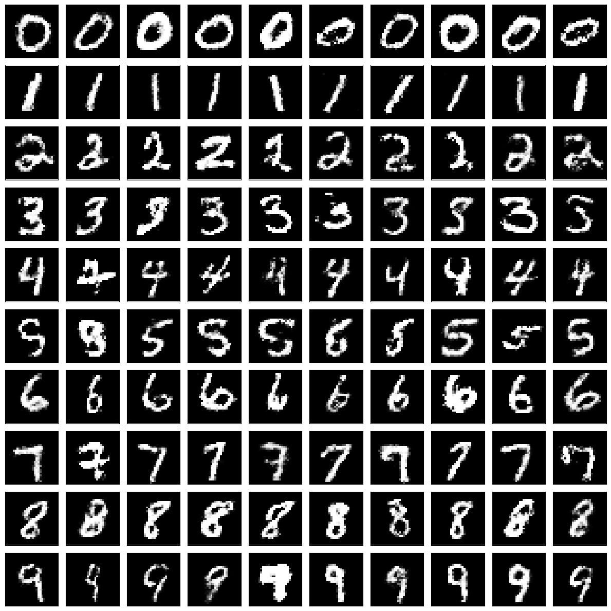

# Conditional Generative Adversarial Networks (Goodfellow et al., 2014)
This code implements the fully connected generator and discriminator for the MNIST dataset as described in Mirza and Osindero (2014), ["Conditional Generative Adversarial Networks"](https://arxiv.org/abs/1406.2661).



*Equation 1: The original GAN objective, where G denotes the generator and D the discriminator (Goodfellow et al., 2014).*


*Equation 2: The CGAN objective, where G denotes the generator and D the discriminator (Mirza and Osindero, 2014).*


*Figure 1: Illustrating the CGAN structure (Mirza and Osindero, 2014).*

## MNIST (fully-connected model)

#### Model Architecture:

Generator:
* Architecture in `./src/cgan_fc.py`
* Learnable parameters: 2413984

Discriminator:
* Architecture in `./src/cgan_fc.py`
* Learnable parameters: 1224351

#### Hyperparameters/Settings:
* Epochs: 100  
* Batch size: 128
* Objective: Binary Cross-Entropy Loss with Logits
* Generator optimizer: Adam
* Discriminator optimizer: Adam
* Generator learning rate: 0.0002  
* Discriminator learning rate: 0.0002  
* Generator betas: (0.5, 0.999)  
* Discriminator betas: (0.5, 0.999)  

#### Training Data:


#### GAN Training Losses:



#### Fake Data:


## Citations

```bibtex
@misc{mirza2014conditionalgenerativeadversarialnets,
      title={Conditional Generative Adversarial Nets}, 
      author={Mehdi Mirza and Simon Osindero},
      year={2014},
      eprint={1411.1784},
      archivePrefix={arXiv},
      primaryClass={cs.LG},
      url={https://arxiv.org/abs/1411.1784}, 
}
```

```bibtex
@misc{goodfellow2014generativeadversarialnetworks,
      title={Generative Adversarial Networks}, 
      author={Ian J. Goodfellow and Jean Pouget-Abadie and Mehdi Mirza and Bing Xu and David Warde-Farley and Sherjil Ozair and Aaron Courville and Yoshua Bengio},
      year={2014},
      eprint={1406.2661},
      archivePrefix={arXiv},
      primaryClass={stat.ML},
      url={https://arxiv.org/abs/1406.2661}, 
}
```

```bibtex
@misc{goodfellow2013maxoutnetworks,
      title={Maxout Networks}, 
      author={Ian J. Goodfellow and David Warde-Farley and Mehdi Mirza and Aaron Courville and Yoshua Bengio},
      year={2013},
      eprint={1302.4389},
      archivePrefix={arXiv},
      primaryClass={stat.ML},
      url={https://arxiv.org/abs/1302.4389}, 
}
```
